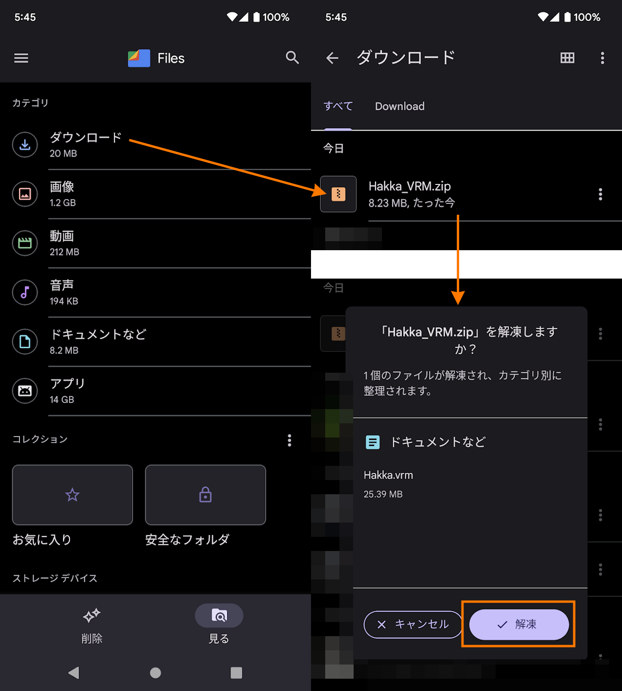

# cluster へのアバター導入手順

[cluster](https://cluster.mu/) とは、cluster 社が開発しているスマートフォンにも対応したメタバースプラットフォームです。
当モデルの一部のアバターは cluster で動作確認済みの VRM ＆改変用の VRM 用プレハブを付属しており、スマートフォンだけでアバターを導入することができます。

導入手順は次のとおりです。

1. [ファイルをダウンロード](setup_cluster.md?id=ファイルをダウンロード)
2. [ファイルアプリで解凍](setup_cluster.md?id=ファイルアプリを解凍)
3. [アバターをアップロード](setup_cluster.md?id=アバターをアップロード)

次で各項目を詳しく説明します。

!> Android/Pixel6 の画面を例に説明していますが、機種によって操作が異なる場合があります。

## ファイルをダウンロード

ブラウザの BOOTH の[購入ページ](https://mio3works.booth.pm/)から名前に「VRM」が付いているファイルをダウンロードします。

※ 自分の作品の購入ページが見られないため、この画像は管理画面です

## ファイルアプリを解凍

アプリ一覧からファイル管理アプリを起動します。Android の場合は主に「Files」iOS の場合は「ファイル App」などを使用してください。

先程ダウンロードしたファイルを選択して解凍します。

## アバターをアップロード

ブラウザで cluster の[アバターページ](https://cluster.mu/account/avatar)を開き「アバターをアップロード」ボタンをタップして「ファイル」を選択します。

先程解凍した拡張子が `vrm` のファイルを選択します。

サムネイルが表示されたら任意に名前を変更してアップロードボタンを押します。

一覧にアバターが追加されて選択できるようになります。
