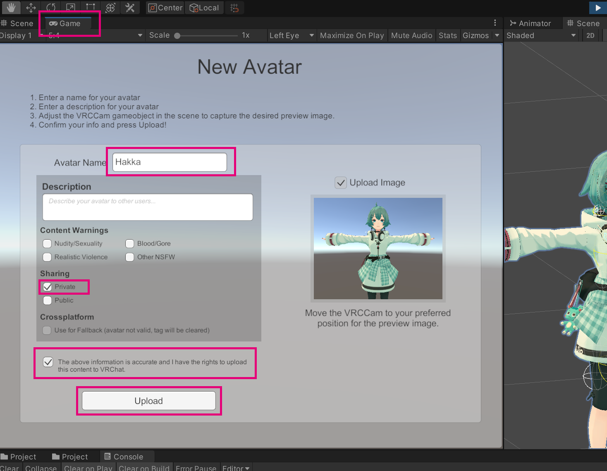

# アバター導入手順 PC 版

はじめてアバターを導入する方は、先に [Unity と VRCSDK の導入手順](vrcsdk.md) をご覧ください。

VRChat PC 版アバターについての導入説明です。説明では薄荷を使用していますが、当モデルのアバターの導入方法はすべて一緒のためご自分のアバターに置き換えてご覧ください。

手順は次のとおりです。

1. [プロジェクトを作成](setup_pc.md?id=プロジェクトを作成)
2. [シェーダーをインポート](setup_pc.md?id=シェーダーをインポート)
3. [アバターの Unitypackage をインポート](setup_pc.md?id=アバターモデルをインポート)
4. [プレハブを適当なシーンにドラッグ＆ドロップ](setup_pc.md?id=シーン上にプレハブを読み込む)
5. [VRCSDK を開きアップロード](setup_pc.md?id=アバターをアップロード)

次で各項目を詳しく説明します。

!> Unity は必ず**指定されたバージョン**をご利用ください。
現在のバージョンは[こちらから確認できます](https://docs.vrchat.com/docs/current-unity-version)。
VRCSDK は公式が配布している[最新のバージョン](https://vrchat.com/home/download)をご利用ください。

## プロジェクトを作成

Unity プロジェクトを作成し VRCSDK をインポートします。

## シェーダーをインポート

シェーダーなどアバター以外の必要なアセットのパッケージをインポートします。

2022/4/6 現在当ショップのアバターのシェーダーはすべて「lilToon」を使用しています。

🍒 [lilToon](https://lilxyzw.booth.pm/items/3087170)

> アクセサリーなどのシェーダーには [UnlitWF](https://github.com/whiteflare/Unlit_WF_ShaderSuite/releases) や [メガネ向けガラスシェーダー](https://oyasumisan.booth.pm/items/1035152) を使用している場合があります。モデルやバージョンによって異なるため、各アバター販売ページの「Shader」の項目をご確認ください。

## アバターモデルをインポート

BOOTH の購入ページから「`Hakka_VRC_v.x_(DateTime).zip`」というファイルをダウンロードして適当な場所に解凍します。いくつかファイルがありますが、ZIP ファイル名に `_VRC` とついているものが VRChat 用のパッケージです。

解凍したフォルダの直下にある `unitypackage` 拡張子のファイルをプロジェクトの「**Assets**」ウィンドウにドラッグ＆ドロップするか、メニューの`Assets > Import Package > Custom Package` からファイルを選択してインポートします。

## シーン上にプレハブを読み込む

インポートすると Project ウィンドウに `mio3io > Hakka` というフォルダが作成されます。
`Hakka` フォルダの直下にあるプレハブ `Hakka_Normal.prefab` を適当なシーンの Hierarchy にドラッグ＆ドロップします

右下のバーでファイル一覧の表示形式を切り替えられます。

アバターがピンク色になっている場合は必要なシェーダーがインポートされていません。[シェーダーをインポート](setup_pc.md?id=シェーダーをインポート)の項目に戻ってアセットをインポートしてください。

あとからシェーダーを追加しても表示がおかしくなる場合は一部のパラメータが消えてしまっている可能性があるため、一旦アバターのフォルダを削除してからシェーダー、アバターの順でインポートし直してください。

プレハブやモデルのサムネイルだけがマテリアルエラーになる場合は、ファイルを選択して右クリック > Reimport をしてみてください。

?> プレハブとはシーン上で組み立てたオブジェクトの情報を保存・使い回しできるようにした箱です。揺れものや VRC Avatar Descriptor などが設定された状態になっているため「まって、VRC Avatar Descriptor って何？」という方でも簡単にアバターを使用できます。
プレハブはリンクしており中身を編集すると同じプレハブオブジェクトすべてに反映されます。Unpack をすることでリンクが切れますが、アップデート内容などが適用されなくなる場合があります。

## アバターをアップロード

VRCSDK の Builder タブを開き「`Build & Publish for Windows`」ボタンをおします。

このとき「`A Material on this avatar has custom shader keywords.`」というメッセージが出ても、エラーではなく非推奨のカスタムキーワードを使用しているための警告なので無視してそのままアップロードできます。（現在はシェーダーを変更しなければこの警告が出ることはありません）

ただし `Streaming Mip Maps` というエラーは Auto Fix しても大丈夫です。

少し待つと自動的に再生ボタンが押され Game タブにアップロード画面が表示されます。

任意の名前を入れアップロードします。

!> `Sharing` は必ず `Private` （アップロードした者だけ使用できる） のままにしてください。

新規でアップロードしたアバターは反映まで時間がかかるようなので、10 分ほど待ってから確認してみてください。
ゲーム画面で読み込まれなくても Web サイトで確認できればアップロードされています。
