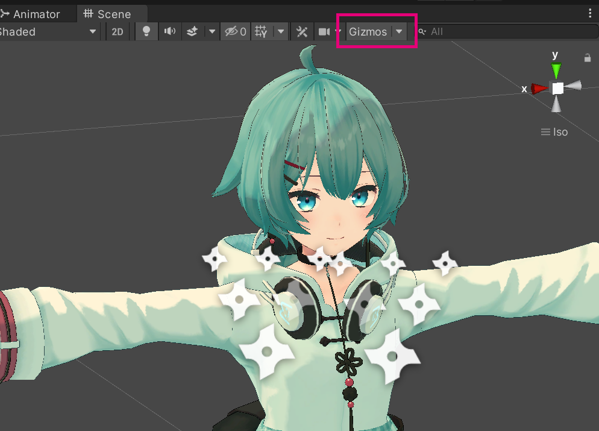
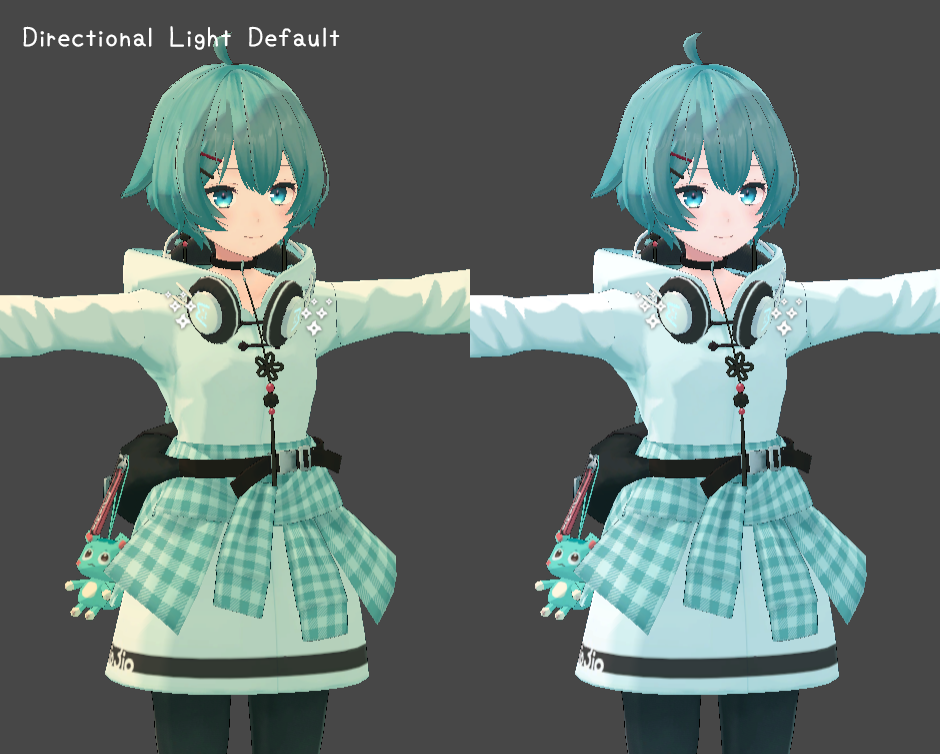

# 汎用 Tips <!-- {docsify-ignore-all} -->

Tips やアバターとは関係のない Q&A など

## 便利な拡張機能やアセット

### Unity でドラッグ＆ドロップした時に上書きできるようにする <!-- {docsify-ignore} -->

https://amagamina.jp/overwriter/

Unity へ同名アセットファイルをドラッグ＆ドロップした時に上書きできるようにする拡張。
テクスチャなどを作成して実際に Unity に盛っていくときは次の拡張を使用すると捗ります

### アセットをディープコピーできるようにするツール <!-- {docsify-ignore} -->

https://github.com/c3-hoge-fuga-piyo/Deeplicate.unity

こちらの[使用例](https://baba-s.hatenablog.com/entry/2019/06/04/081000)のようにマテリアルのテクスチャなど自動で参照先を再設定してくれます

## プレビュー画面を平行投影にする

Unity の Scene の表示方法は Iso（平行投影）にすると視点を変えてもアバターが中心になるので編集しやすくなります。

## タブを複数開く

またタブの右上にあるメニューから各ウィンドウを複数開くことができます。
Scene を 2 つ開くなどして見やすくしたり、Inspector を複数開いてよく編集するものを鍵アイコンでロックしたりできます。

## アニメのプレビューモデルを自分のアバターにする

アニメーションファイルを直接編集する場合は、Hierarchy 上にあるモデルをプレビューのところに D＆D するとオジサンではなく任意のモデルでプレビューできます。

## ボーンを変形しても勝手に戻ってしまう場合

DynamicBone が設定されているボーンは変形させても自動的に戻ってしまうことがあります。
一時的に DynamicBone のチェックボックスをオフにしてからボーンを変形させ、GAME タブで一度再生してから DynamicBone のチェックボックスをオンに戻すと固定されます。

## パーツによって明るさが変わる

髪やアクセサリーを変更するとメッシュの設定によって角度で消えたり明るさが変わってしまうことがあります。

髪やパーツを変更する場合は「Bounds」と「AnchorOverride」を他のメッシュと合わせるようにすると角度によってに明るさが変わったり消えません。AnchorOverride は追加するオブジェクトのメッシュの「AnchorOverride」の項目にアバター直下にある「AnchorTarget」を D&D してください。

Bounds を設定するにはがとーしょこらさんの [VRCAvatarEditor](https://booth.pm/ja/items/1258744) を使用するのがおすすめです。

## 手裏剣のようなマークがある

パーティクルの存在を示すアイコンです。右上の「Gizmos」からサイズを変えたり消すことが出来ます。

## View Position の丸が消えてしまった

Gizmo が一括 OFF になっている可能性があります。右上の「Gizmos」をクリックして切り替えてください。

## 全体的に黄色い

Unity プロジェクトの標準の Directional Light の色が若干黄色いためです。

アップロードしたアバターに影響は出ないため特に変更する必要はありませんが、ライトを白くするとエディター上でも VRChat のホームワールドと同じような見た目になります。
